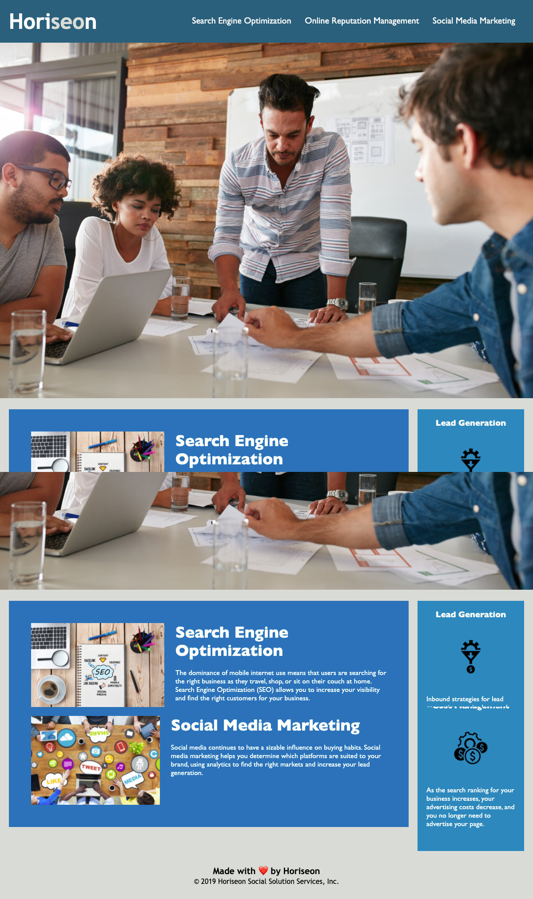
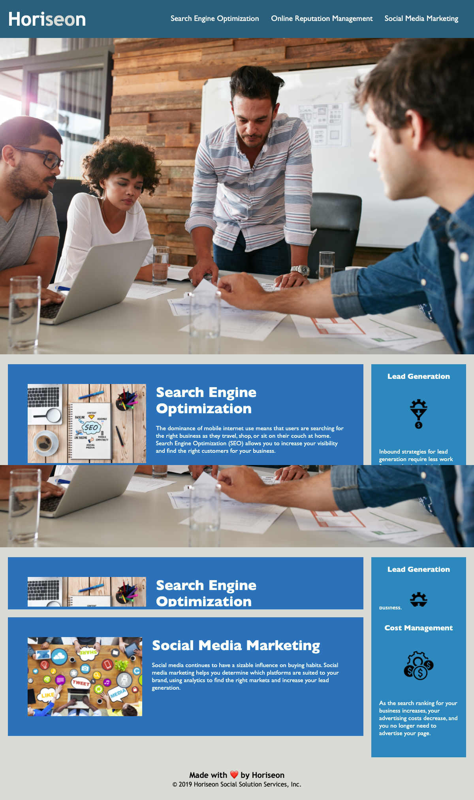

# semantic-html-refactor

## GitHub Pages

Find the deployed application on GitHub pages [here](https://sumiyaib.github.io/semantic-html-refactor/)

## Description

Refactor a marketing agency website to use semantic HTML elements and improve accessibility.

## Work Done

- Refactored a marketing agency website to use semantic HTML elements such as header, nav, main, section, aside, footer, etc.
- Refactored CSS to remove any duplicate style definitions
- Improved the accessibility of images and fixed navigation links.

## Technologies Used

- HTML
- CSS

## Screenshots

### Before Refactor

### After Refactor

